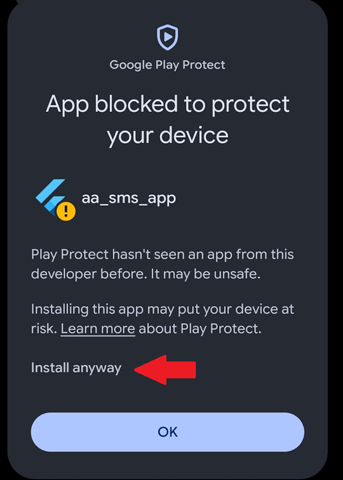

# A&A SMS Gateway (Android)

A lightweight, native Android client built for Andrews & Arnold (A&A) VoIP customers to quickly compose and send SMS messages using their A&A HTTP API credentials.

---

## 📱 Features

* **Direct A&A API Integration:** Sends SMS messages directly via the official A&A HTTP Gateway (`sms.aa.net.uk`).
* **Secure Credential Storage:** Saves your API username and password locally using hardware-backed Android Keystore encryption (`flutter_secure_storage`).
* **Contact Integration:** Easily pick destination numbers directly from your phone's address book.
* **Modern Material 3 UI:** Clean, dark-mode interface designed for quick messaging.

---

## 🚀 Installation (Sideloading)

> **Note:** The source code for this project is currently private while under active development. Only pre-compiled Android packages (`.apk`) are provided at this stage prior to a full Google Play Store release.

To install and run the app on your Android device:

1. Download the latest `app-release.apk` from the official Releases page:
   👉 **[https://github.com/mattfaraday/aa-sms-gateway/releases](https://github.com/mattfaraday/aa-sms-gateway/releases)**

2. Open the downloaded `.apk` file on your Android device.

3. If prompted by Android security, allow installation from unknown/external sources:
   * **Android 8.0+:** Tap **Settings** on the prompt and enable *"Allow from this source"* for your browser/file manager.
   * **Older Android versions:** Go to **Settings > Security > Unknown Sources** and toggle it on.

4. Follow the on-screen installer prompts and open **A&A SMS Gateway**.

**Note:** if you see this

you need to press "Install anyway" 

---

## ⚙️ Configuration & Usage

1. Open the app and enter your **Andrews & Arnold API Username** (e.g., your assigned phone number/account identifier) and **SMS Password**.
2. Credentials are automatically saved securely on your device upon your first sent message.
3. Type or select a recipient phone number using the contact picker icon.
4. Type your message and hit **Send SMS**.

---

## ⚠️ Pre-Release & Liability Disclaimer

* **Pre-Release Software:** This software is provided as a **pre-release preview** and may contain bugs, incomplete features, or experience unexpected behavior.
* **No Warranty / Liability:** This application is provided **"as is"**, without warranty of any kind, express or implied. In no event shall the author or copyright holder be held liable for any claim, damages, API costs, messaging charges, missed transmissions, or other liability arising from the use of this software.
* **Third-Party Service:** This project is an independent utility and is not officially affiliated with, endorsed by, or maintained by Andrews & Arnold Ltd. You are responsible for any SMS billing charges incurred on your A&A account.

---

© 2026 Matt Faraday. All rights reserved.
